# 材質分類人工檢查報告 — scan_20260906

產生日期：2026-09-08　／　ruleset_version: 2

這份報告的用途是**讓你用眼睛驗證分類對不對**。做法是把每一類裡最大的幾個色塊，
到原始貼圖上找出對應的照片區域裁下來 —— 也就是「機器看到這些像素，把它判成木頭/玻璃/金屬」。
圖片在 `plan/scan_materials/`。

---

## 1. 分類結果總表

| 材質 | 面數 | 面積 | 佔比 | 色塊總數 | 其中 ≥1 m² |
|---|---:|---:|---:|---:|---:|
| itu_concrete | 79,761 | 1,137.5 m² | 88.8% | 139 | 2 |
| itu_wood | 4,512 | 59.8 m² | 4.7% | 35 | 25 |
| itu_glass | 4,591 | 56.7 m² | 4.4% | 30 | 15 |
| itu_metal | 1,862 | 26.7 m² | 2.1% | 49 | 4 |

分類規則（詳見 `scan_material_classifier.py`）：
1. 水平面（地板/天花，31% 面積）與斜面（掃描雜訊，17%）**一律 concrete**
2. 只有垂直面（53%）進色彩規則，看 HSV 判 wood / glass / metal
3. 小於 0.3 m² 的非混凝土色塊退回 concrete（真實的門窗不會那麼小）

---

## 2. itu_wood（4.7%）— **判得好，可信**

| # | 面積 | 尺寸 (x,y,z) | 離地高度 | 位置 (x,z) | 照片 |
|---|---:|---|---|---|---|
| 0 | 4.80 m² | 2.77 × 2.61 × 0.43 m | −0.04 ~ 2.56 m | (−1.5, −27.4) | 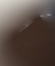 |
| 1 | 4.34 m² | 0.14 × 2.15 × 2.39 m | 0.05 ~ 2.19 m | (4.7, 4.2) | 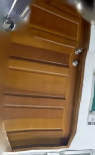 |
| 2 | 3.83 m² | 0.59 × 2.31 × 2.94 m | −0.24 ~ 2.06 m | (4.3, −18.3) | 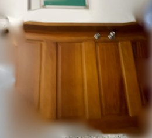 |
| 3 | 3.39 m² | 1.80 × 2.63 × 1.39 m | 0.20 ~ 2.83 m | (3.6, 13.6) | 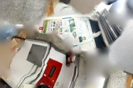 |

**#1 和 #2 的照片就是清清楚楚的木門**（深褐色、看得到門板分割線與門把）。
尺寸也對：厚度 0.14 / 0.59 m、高 2.15 / 2.31 m、**從地板（0.05 m）長到門楣（2.2 m）**，
這正是一扇門該有的樣子。25 個 ≥1 m² 的色塊也符合一條 65 m 走廊上的門數量。

**結論：wood 這一類可以直接用。**

---

## 3. itu_glass（4.4%）— **不可信，多半是過曝的白牆**

| # | 面積 | 尺寸 | 離地高度 | 位置 | 照片 |
|---|---:|---|---|---|---|
| 0 | 6.26 m² | 0.48 × 1.96 × 4.58 m | 0.69 ~ 2.65 m | (2.6, −6.0) | 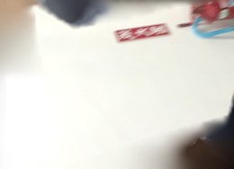 |
| 1 | 5.85 m² | 3.37 × 2.16 × 3.20 m | 0.60 ~ 2.76 m | (−5.7, 10.0) |  |
| 2 | 5.68 m² | 0.23 × 2.40 × 4.42 m | 0.69 ~ 3.10 m | (0.7, 24.7) | 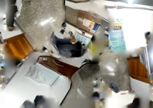 |
| 3 | 5.37 m² | 0.20 × 1.70 × 6.17 m | 0.77 ~ 2.47 m | (2.6, 3.5) | 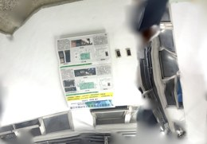 |

照片裡看到的是**白色桌面、貼著紙的白牆、整片死白的模糊區域**，不是玻璃。

原因很直接：規則是「亮度 > 0.90 且飽和度 < 0.14」——這是想抓「窗戶在照片裡過曝成一片白」，
但**室內的白牆、白色門框、反光的白色桌面在照片裡長得一模一樣**。手機/相機的自動曝光
會把室內白牆也推到接近純白，兩者在 HSV 上分不開。

幾何線索也對不上：#3 沿 z 軸長 6.17 m、#0 長 4.58 m —— 窗戶不會是連續 6 公尺的一整片，
那比較像**一整面牆**被判進去了。

**這一類的誤判有實質影響**：`itu_glass` 的穿透率遠高於混凝土，把白牆當成玻璃會讓
訊號「穿牆而過」，室內隔離度被嚴重低估。

---

## 4. itu_metal（2.1%）— **不可信，且量太少**

| # | 面積 | 尺寸 | 離地高度 | 位置 | 照片 |
|---|---:|---|---|---|---|
| 0 | 1.46 m² | 1.80 × 1.76 × 0.29 m | 0.60 ~ 2.37 m | (1.8, 32.7) | 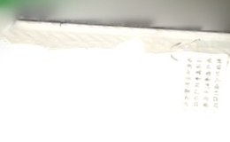 |
| 1 | 1.27 m² | 0.15 × 0.99 × 2.07 m | 2.04 ~ 3.04 m | (4.7, 2.3) | 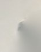 |
| 2 | 1.14 m² | 0.19 × 0.84 × 2.81 m | 2.05 ~ 2.90 m | (4.3, −16.6) | 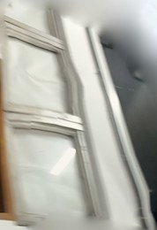 |
| 3 | 1.03 m² | 0.19 × 0.84 × 2.81 m | 0.79 ~ 2.81 m | (−2.9, −24.4) | 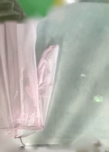 |

照片是白牆帶字、小塊白色、有窗框的窗戶、粉綠色的布狀物 —— **沒有一張是金屬**。

49 個色塊裡只有 4 個 ≥1 m²，其餘全是碎片；#1 #2 離地 2.0–3.0 m（在門楣以上），
形狀是細長條，比較像**牆與天花板交界處的高光帶**被誤判。

`itu_metal` 是幾乎全反射的材質，錯誤指派會憑空造出強反射面。

---

## 5. itu_concrete（88.8%）— 預設類，沒問題

最大的色塊就是整個走廊主體（1,128 m²，涵蓋整個 14.3 × 6.3 × 65.4 m 的範圍）。
其餘 138 個都是被 despeckle 退回來的碎片。照片看到的是磨石子地板、白牆、公告欄 ——
這些本來就該是 concrete。

---

## 6. 建議

**現況（ruleset v2）不建議直接拿去跑正式模擬。** 三個選項：

| 選項 | 做法 | 影響 |
|---|---|---|
| **A（建議）** | **關掉 glass 與 metal，只留 wood** | concrete 95.3% + wood 4.7%。少掉的 6.5% 面積回到 concrete —— 保守但不會憑空造出穿透面或反射面 |
| B | 大幅收緊門檻並加幾何條件（例如玻璃必須成矩形、寬高比接近窗戶、且不得連續超過 2 m） | 要再迭代幾輪，且照片過曝的本質問題還在 |
| C | 人工標註：把 25 個 wood 色塊 + 少數真窗戶手動指定 | 最準，但要有標註介面 |

如果你要我做 A，改一個開關就好（`classify()` 加參數 / 或把 `GLASS_*`、`METAL_*` 門檻設成
不可能達到的值），重新匯入一次即可，Mitsuba 場景會跟著重產。

**一個誠實的提醒**：先前 Sionna 那組覆蓋數字，就是用現在這份（含誤判的 glass/metal）
材質跑出來的。趨勢仍然可信（牆有擋、距離有衰減），但絕對值會受影響。
